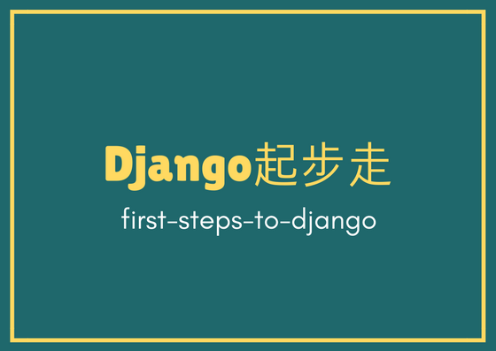

# Django起步走(first-steps-to-django)
by [Pycone 松果城市](http://pycone.com) x ccClub

  
Django入門課程  
每一個範例皆是可以執行的程式

## 課程單元
1. [建立第一個Django project](create-first-django-project)
2. [建立部落格文章model](create-blog-post-model)

## Pycone松果城市
* [網站連結](http://www.pycone.com/)
* [粉絲專頁](https://www.facebook.com/pycone2016/)
* [初心者-Python入門](https://hahow.in/cr/python-for-beginners)
* [Python 網頁爬蟲入門實戰](https://hahow.in/cr/python-web-crawler)
