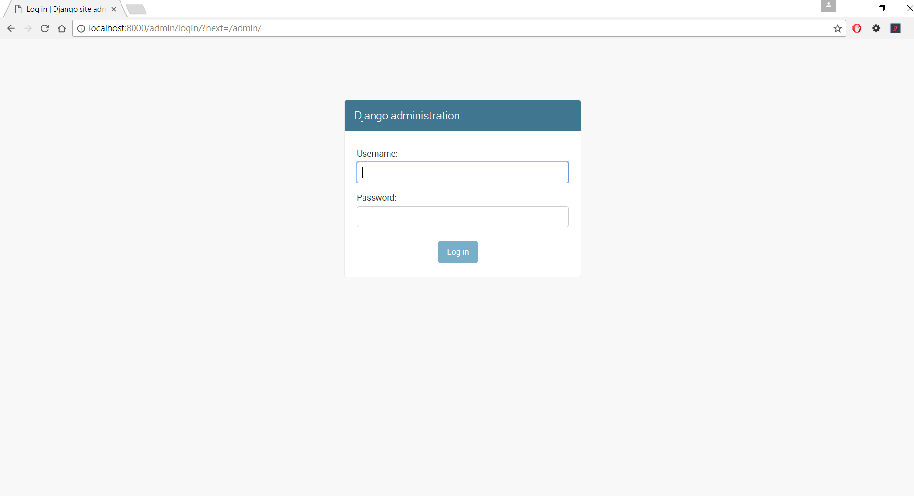
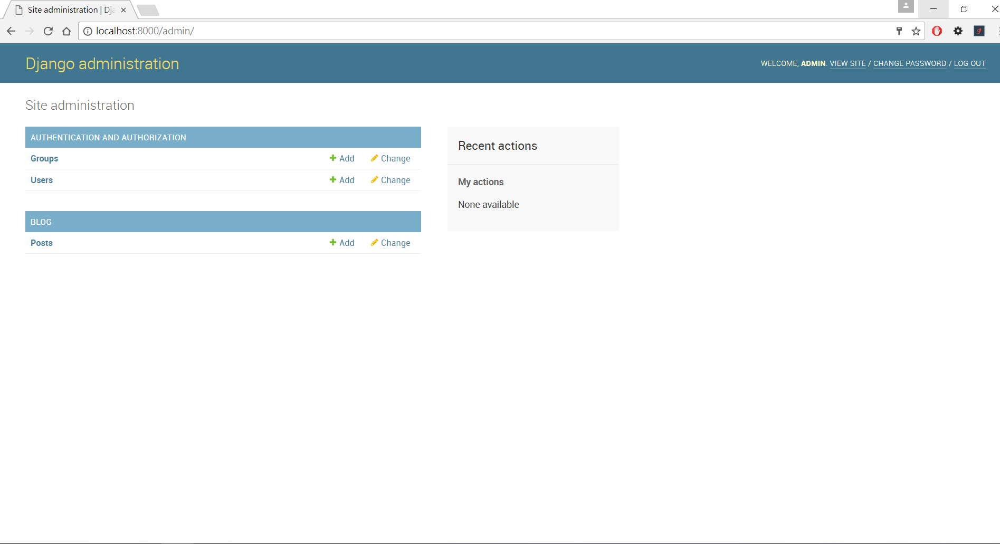
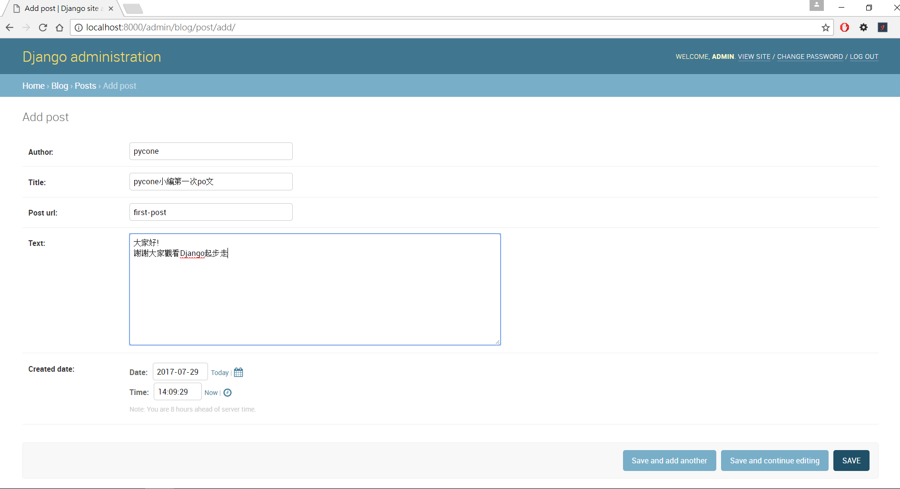
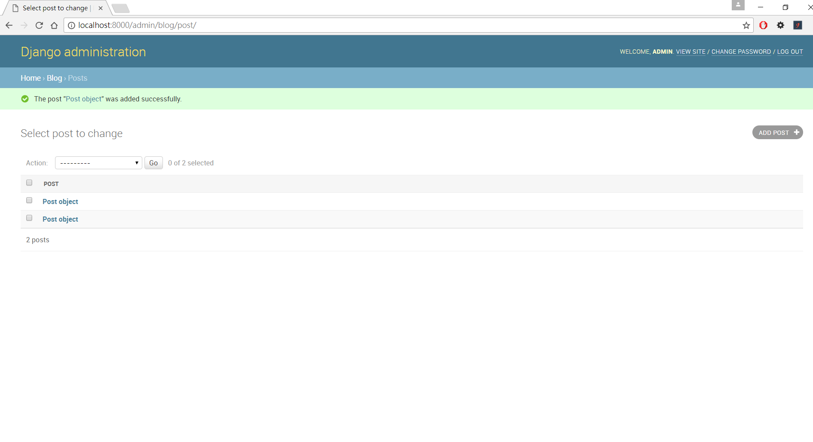
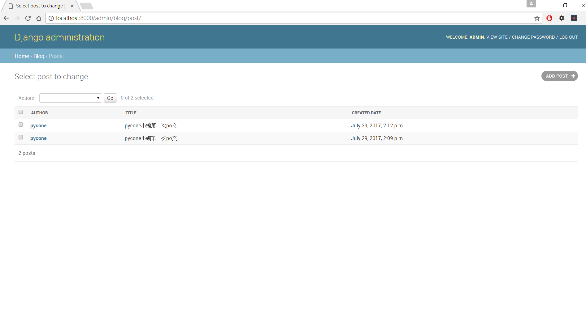
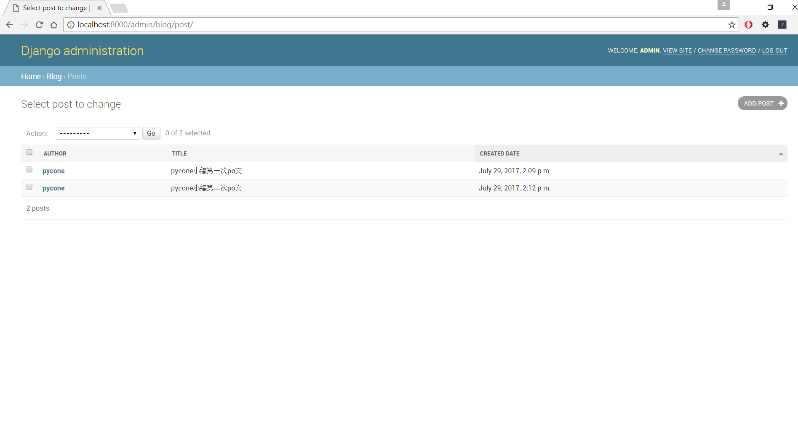

# 建立部落格文章model
我們在`建立第一個Django project`建立一個可運行的網站, 但還沒有任何的內容。這次教學會建立文章的資料, 並且利用Django admin管理資料。  

## 建立model
透過Django model與database互動, 使用SQLite database來儲存資料。Django model透過Object Relational Mapping(ORM), 讓我們透過Python物件就能建立資料與存取資料。  
在pycone_blog/blog/models.py新增post model
```
from django.db import models
from django.utils import timezone

# Create your models here.
class Post(models.Model):
    author = models.CharField(max_length=100)
    title = models.CharField(max_length=100)
    post_url = models.CharField(max_length=100)
    text = models.TextField()
    created_date = models.DateTimeField(
            default=timezone.now)
```

## 建立migration
makemigrations指令產生先前所建立的model所對應的migration檔案。
```
$ python3 manage.py makemigrations
Migrations for 'blog':
  blog\migrations\0001_initial.py:
    - Create model Post
```

如pycone_blog/blog/migrations/0001_initial.py

```
from __future__ import unicode_literals

from django.db import migrations, models
import django.utils.timezone


class Migration(migrations.Migration):

    initial = True

    dependencies = [
    ]

    operations = [
        migrations.CreateModel(
            name='Post',
            fields=[
                ('id', models.AutoField(auto_created=True, primary_key=True, serialize=False, verbose_name='ID')),
                ('author', models.CharField(max_length=100)),
                ('title', models.CharField(max_length=100)),
                ('post_url', models.CharField(max_length=100)),
                ('text', models.TextField()),
                ('created_date', models.DateTimeField(default=django.utils.timezone.now)),
            ],
        ),
    ]

```

## model與database
使用migrate指令將migration檔將model同步到database
```
$ python3 manage.py migrate
Operations to perform:
  Apply all migrations: admin, auth, blog, contenttypes, sessions
Running migrations:
  Applying contenttypes.0001_initial... OK
  Applying auth.0001_initial... OK
  Applying admin.0001_initial... OK
  Applying admin.0002_logentry_remove_auto_add... OK
  Applying contenttypes.0002_remove_content_type_name... OK
  Applying auth.0002_alter_permission_name_max_length... OK
  Applying auth.0003_alter_user_email_max_length... OK
  Applying auth.0004_alter_user_username_opts... OK
  Applying auth.0005_alter_user_last_login_null... OK
  Applying auth.0006_require_contenttypes_0002... OK
  Applying auth.0007_alter_validators_add_error_messages... OK
  Applying auth.0008_alter_user_username_max_length... OK
  Applying blog.0001_initial... OK
  Applying sessions.0001_initial... OK
```

## Django admin
Django admin是Django預設的資料庫管理介面, 使用之前先建立管理者的帳號與密碼
```
$ python3 manage.py createsuperuser
Username: admin
Email address:
Password:
Password (again):
Superuser created successfully.
```

將Post加入admin管理葉面
在pycone_blog/pycone_blog/models.py新增post model  
```
from django.contrib import admin
from .models import Post

# Register your models here.
admin.site.register(Post)
```

在瀏覽器網址中打上 localhost:8000/admin, 即可在瀏覽器畫面中看到Django admin


打入剛剛創建的帳號密碼即可進入admin頁面


可以看到我們剛剛定義的Post model在admin管理頁面, 接著按 `+ Add` 來新增一筆資料


將資料輸入, 並且儲存。再多輸入幾筆資料


Admin目前預設顯示資料不完整, 我們可以針對admin介面進行客製化
```
from django.contrib import admin
from .models import Post

# Register your models here.
class PostAdmin(admin.ModelAdmin):
    list_display = ('author', 'title', 'created_date')

admin.site.register(Post, PostAdmin)
```

可以看到客製化的post結果

admin還可以針對欄位進行排序
這邊示範針對文章創造日期排序, 設定ordering tuple, 指定欄位, 資料便會依照指定欄位排序。加入`-`即可descending order
```
from django.contrib import admin
from .models import Post

# Register your models here.
class PostAdmin(admin.ModelAdmin):
    list_display = ('author', 'title', 'created_date')
    ordering = ('-created_date', )

admin.site.register(Post, PostAdmin)
```


可以比較created_date欄位的順序差異
