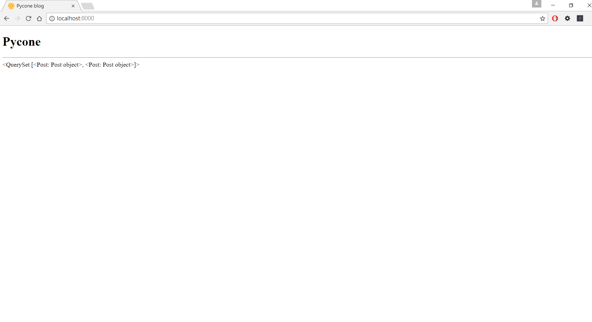

# 建立部落格文章template
我們在`建立部落格文章 model`建立一個model, 並且將資料存入datase當中。這次教學會將資料存database拿出, 並利用template顯示。  

## 建立template
新增 templates 資料夾在 /src 下
修改pycone_blog/pycone_blog/settings.py, 將DIRS路徑指向剛剛新增templates資料夾路徑
```
TEMPLATES = [
    {
        'BACKEND': 'django.template.backends.django.DjangoTemplates',
        'DIRS': [os.path.join(BASE_DIR, 'templates')],
        'APP_DIRS': True,
        'OPTIONS': {
            'context_processors': [
                'django.template.context_processors.debug',
                'django.template.context_processors.request',
                'django.contrib.auth.context_processors.auth',
                'django.contrib.messages.context_processors.messages',
            ],
        },
    },
]
```

## 新增index template
在/templates 新增index.html
```
<!DOCTYPE html>
<html lang="en">
<head>
  <meta charset="UTF-8">
  <meta name="viewport" content="width=device-width, initial-scale=1.0">
  <meta http-equiv="X-UA-Compatible" content="ie=edge">
  <title>Pycone blog</title>
</head>
<body>
  <h1>Pycone</h1>
  <hr />
  {{posts}}
</body>
</html>
```

## model, view與template首次結合
`from django.template.loader import get_template`可以拿出index template
`Post.objects.all()`可以從database拿出Post資料
`index_template.render(locals())`將資料與template結合, locals()可以將區域變數使用dict傳出
修改pycone_blog/blog/views.py
```
from django.shortcuts import render
from django.http import HttpResponse
from .models import Post
from django.template.loader import get_template
# Create your views here.
def response_hello_world(request):
    return HttpResponse('Hello, World!')

def render_index(request):
    index_template = get_template('index.html')
    posts = Post.objects.all()
    index = index_template.render(locals())
    return HttpResponse(index)

```
## 修改url
http://localhost:8000/ 指向index
http://localhost:8000/hello-world 指向create-first-django-project的範例
```
from django.conf.urls import url
from blog import views

urlpatterns = [
    url(r'^hello-world$', views.response_hello_world),
    url(r'^$', views.render_index),
]
```
在瀏覽器網址中打上 localhost:8000, 可以看到posts物件顯示在瀏覽器中, 但沒有物件的屬性 
  

讓我們新增物件的屬性, 利用模板語言 {{ post.title }}可以取出屬性, 可以疊代物件
```
<!DOCTYPE html>
<html lang="en">
<head>
  <meta charset="UTF-8">
  <meta name="viewport" content="width=device-width, initial-scale=1.0">
  <meta http-equiv="X-UA-Compatible" content="ie=edge">
  <title>Pycone blog</title>
</head>
<body>
  <h1>Pycone</h1>
  <hr />
  
    <h1>{{ post.title }}</h1>
    <p>{{ post.author }}</p>
    <p>{{ post.created_date }}</p>
    <p>{{ post.text }}</p>
    <hr />
  
</body>
</html>
```

  
我們取出每一篇文章的標題, 作者, 發文時間與內容

範例到這邊我們使用過Django 4個元件, 分別是Model, View, Templare, URL dispatcher。
讓讀者先對Django有個全局的了解, 接下來會講解Django MTV架構與4個元件更完整的用法。
之後會回來繼續將blog修改得更棒!