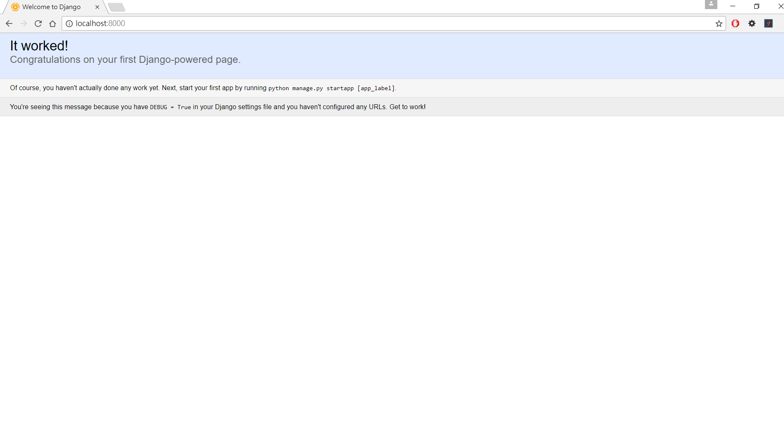
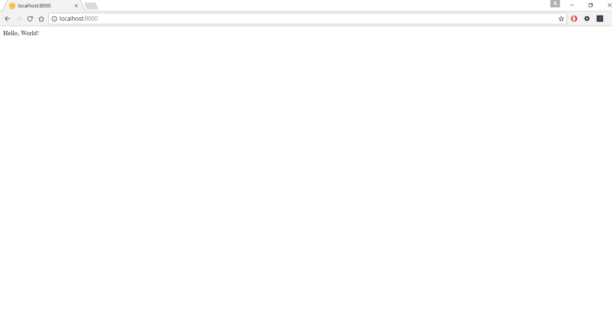

# 建立第一個Django project
第一個Django project會快速讓讀者有個建立Django專案的全貌, 細節與進階功能會再往後的章節一一說明。

## 安裝開環境
整個教學會使用Python3，如果對Python不熟悉可以參考
* [初心者-Python入門](https://hahow.in/cr/python-for-beginners)
* [codecademy Python](https://www.codecademy.com/learn/python)

安裝Django
```
$ pip install django
```

## 新增Django project
建立Django project 
```
$ django.admin.py startproject behappycc_blog
```
啟動Django server, 將web應用程式運行
```
$ python3 manage.py runserver 0.0.0.0:8000
```

在瀏覽器網址中打上 localhost:8000, 即可在瀏覽器畫面中看到Django成功運行了



## 新增Django app
建立Django app
```
$ python3 manage.py startapp blog
```
將剛剛建立blog app, 安裝於project當中, 修改behappycc_blog/settings.py中的 INSTALLED_APPS
```
INSTALLED_APPS = [
    'django.contrib.admin',
    'django.contrib.auth',
    'django.contrib.contenttypes',
    'django.contrib.sessions',
    'django.contrib.messages',
    'django.contrib.staticfiles',
    'blog',
]

## 修改Project URL配置
```
URL配置是為了告訴瀏覽器當使用者輸入網址之後, 程式要用哪一段邏輯處理
在behappycc_blog/behappycc_blog修改urls.py, include函式可以將app的URL配置加入project的URL配置當中,
當然也可以直接寫在project配置當中, 但是如果當程式日益增大時, 不容易管理  
`from django.conf.urls import include` import include函式  
`url(r'^', include('blog.urls'))`  將app的URL配置加入project的URL配置當中
```
from django.conf.urls import url
from django.contrib import admin
from django.conf.urls import include

urlpatterns = [
    url(r'^admin/', admin.site.urls),
    url(r'^', include('blog.urls')),
]

```

## 新增blog view
Django view會負責將資料回應給使用者, 之後課程中會講解Django MTV架構(model, template與view)
在behappycc_blog/blog/views.py新增
```
from django.shortcuts import render
from django.http import HttpResponse

# Create your views here.
def response_hello_world(request):
    return HttpResponse('Hello, World!')
```

在behappycc_blog/blog當中新增urls.py
```
from django.conf.urls import url
from blog import views

urlpatterns = [
    url(r'^$', views.hello_world),
]
```

在瀏覽器網址輸入 localhost:8000 來檢視我們的成果, 即可在瀏覽器中看到`Hello, World!`

